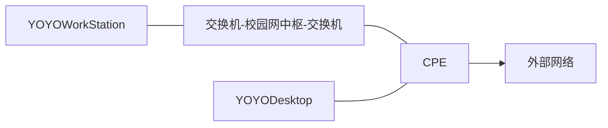

> BUCEA 校园网按流量计费，每 G 下行流量 0.5 元，这谁用得起？
>
> 一个自然而然的想法就是使用 5G CPE 替代校园网。但是我在宿舍和实验室各有一台电脑，均需要网络连接。如果各配置一台 CPE 的话，硬件成本和流量成本直接翻倍。
>
> 因此尝试转发流量到作为唯一网关的 CPE 上。

<!-- more -->

为了摆脱校园网花费了我很大心思。学校流量又贵，我又是个流量大户，每个月都要给学校交几十块钱网费，纯纯大冤种。

在尝试诸多方案后，才有了这篇文章。这应该是长期来看成本最低的解决方案了，只需要一次性投入不到 300 元的硬件成本（而且以后不用了还能转卖二手），就可以摆脱对校园网高价流量的依赖。

先说情景。我有两台需要长期保持联网的电脑，分别放在宿舍和实验室，称之为 YOYODesktop 和 YOYOWorkStation。以及一台 CPE 作为网关。网络结构如图：



## 1 5G CPE

## 2 虚拟组网

### 2.1 连通性检查

在谈论一切之前，首先要保证上述网络是通畅的，即 YOYOWorkStation 能和 CPE 相互连接。首先使用`ipconfig`查看 IP：

|          | YOYOWorkStation |      CPE      |
| :------: | :-------------: | :-----------: |
|   IPv4   |   10.100.x.a    |  10.100.y.b   |
| 子网掩码 |  255.255.192.0  | 255.255.192.0 |
|   网关   |   10.100.0.1    |  10.100.0.1   |

这两台设备的子网掩码均为`255.255.192.0`，计算得到覆盖的 IP 范围为`10.100.0.0`~`10.100.63.255`。两台设备的 IP 均在此范围内，因此理论可以相互访问。

接下来检查实际连接情况。互相 Ping 对方，成功。SSH 连接，成功。FTP 文件服务器，成功。Windows 远程桌面连接，成功。

因此可认定两台电脑在校园网环境下可以相互访问。

### 1.2 ZeroTier

最简单的实现方案并不包括虚拟组网，因为这两台机器本身就在同一个局域网内。但是，你也不想自己的流量被校园网监控吧？

[ZeroTier](https://www.zerotier.com/) 可以为设备添加虚拟网卡并分配虚拟 IP，从而实现虚拟组网。ZeroTier 的数据流量是端到端加密的，因此无需担心隐私泄露等问题。

#### 1.2.1 网络控制器配置

注册账号，新建网络。然后在 Settings - Basics 中配置网络的基本信息，注意 Access Control 一栏务必选择`Private`。 

::: center
{.h-300}
:::

然后是 Settings -  Advanced，这里管理分配 IP 的网段，可以不改。我选择了自己喜欢的`191.168.196.x`。

::: center
{.h-300}
:::

记下网络的 Netword ID，后续凭借此 ID 加入网络。

#### 1.2.2 客户端配置

然后在需要组网的设备上[下载客户端](https://www.zerotier.com/download/)。

查看 ZeroTier 客户端状态：

```bash
sudo zerotier-cli status
```

```text
200 info 46xxxxxx21 1.14.2 TUNNELED
```

其中`46xxxxxx21`是设备 ID。加入网络后你可以在网络控制器中看到它。

然后加入网络：

```bash
sudo zerotier-cli join 652xxxxxxxxxxebc
```

```text
200 join OK
```

则说明加入网络成功。按命令将所有设备加入网络。回到网络控制器上，可以看到网络中多出的成员：

::: center

:::

新加入的成员处于`Unauthorize`状态，即未被授权。全选所有成员，然后点击`Authorize`按钮进行授权。完成授权后稍微等待一下，网络控制器会自动为其分配虚拟 IP。

::: center

:::

回到设备上，再次使用`sudo zerotier-cli status`查看状态：

```text
200 info 46xxxxxx21 1.14.2 ONLINE
```

则组网成功，此时可以使用虚拟 IP 访问网络内的所有设备。

## 2 全局流量转发

流量转发的方式有很多。较低层的，可以通过修改路由表的方法将流量转发。这种方式性能最高，但配置难度也最大，出错后改正也极其麻烦（问就是踩过坑）。因此这里采用 Clash 转发流量。

CPE 处的 Clash 只需开启允许局域网访问即可，端口默认为`7890`。

YOYOWorkStation 处的 Clash 则进行全局流量转发，需要编写配置文件：

```yaml
port: 7890
allow-lan: false
mode: Rule
log-level: info
external-controller: 127.0.0.1:9090
tun:
  enable: true
  stack: system
  dns-hijack:
    - 198.18.0.2:53
  auto-route: true
  auto-detect-interface: true

# 代理出口
proxies:
  - name: "YOYOProxy"
    type: socks5
    server: 192.168.196.x
    port: 7890

# 代理组
proxy-groups:
  - name: "全局流量转发"
    type: select
    proxies:
      - YOYOProxy

# 分流规则
rules:
  - MATCH,GLOBAL
```

这里我启用了 Clash 的 TUN 模式。该模式会创建一个虚拟网卡，把系统所有流量截获下来，内部再走代理规则。相较于系统代理，这种方式略微慢一些，但优势在于这是真正的全局透明代理，应用内无感知，且支持 TCP/UDP。更别说不是所有软件都遵守系统代理（比如游戏、某些命令行工具）。

在 Clash 内启用代理即可。

当在 YOYOWorkStation 处 Clash 的看到这种日志时，就说明流量转发成功了。

```text
FROM: 198.18.0.1:53217, RULE: Match(), PROXY: GLOBAL[YOYODesktopProxy]
```

此时 CPE 处 Clash 日志应该为：

```text
FROM: 192.168.196.y:54204, RULE: Match(), PROXY: DIRECT
```

这说明 CPE 处的 Clash 成功接收到了来自 YOYOWorkStation 的流量。
